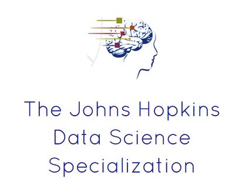

Data Science Specialization Final Project
========================================================
font-family: 'verdana'
transition: rotate

</img>

 
How to predict the next word?    

 

Discussion materials

By: M P

Date: Sat May 22 07:31:24 2021

Objective
========================================================

This presentation is just an application, of up to 7 months of work on the Data Science Specialization by Johns Hopkins University. 

The aim of this exercise is to create a product to highlight the prediction algorithm that you have built and to provide an interface that can be accessed by others. 

Before building the word prediction algorithm...
========================================================
We work on the following:

1. Overview, understanding the problem, and getting the data

2. Exploratory data analysis and modeling

3. Build and evaluate the prediction model

4. Reducing computational runtime and model complexity.

Before building the word prediction algorithm... -(cont'd)
========================================================
After this steps, the result was split into three N-grams files: gram2, gram3
and  gram4 
### How does it work?

  

In short, the model takes the last few words of a sentence (a 4-gram if four words are used, 3-gram for three words, etc.) and uses statistics based on a large collection of English sentences to find the most probable next word, given that set of sentences.
 

The resulting language model is stored in a set of data files: a file for unigrams, a file for bigrams, etc. The information in these files is similar to the <a href="http://www.speech.sri.com/projects/srilm/manpages/ngram-format.5.html">ARPA format files</a> for n-gram models.

  

Instructions
========================================================

For this project we must submit: 

A Shiny app that takes as input a phrase (multiple words) in a text box input and outputs a prediction of the next word.

*[My Shiny App]* -  

[https://rizki4myp.shinyapps.io/datasciencecapstone/]
 

About the Capstone Project
========================================================

The capstone project class allows students to create a usable/ public data product that can be used to showcase your skills to potential employers. Projects will be drawn from real-world problems and will be conducted with industry, government, and academic partners.

For more details: 

[https://www.coursera.org/specializations/jhu-data-science]
 

Shiny Application
========================================================

A Shiny application was developed based on the next word prediction model described previously as shown below. 
###  How to use the application. ###

<ol>
<li> The user enters a partial sentence in the <strong>text input field</strong> on the right.</li>
<li> The <strong>predicted word</strong> appears in black. </li>

Shiny Application
========================================================

For example if you write "Who are"

###  How to use the application. ###

<li> The <strong>predicted word</strong> is "you". </li>

